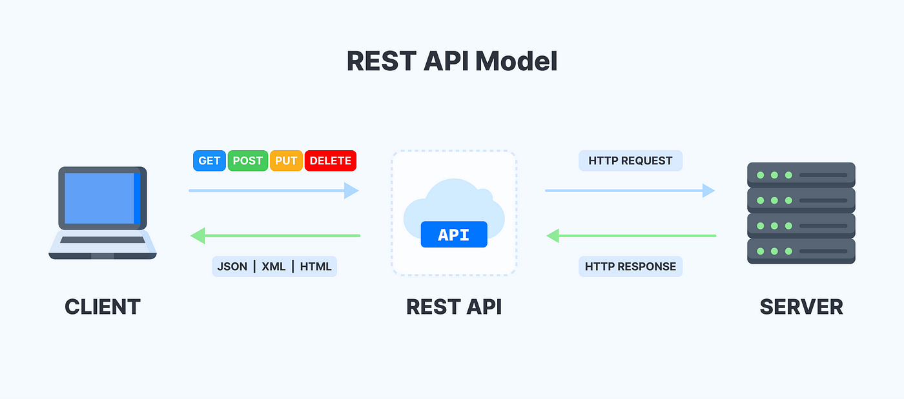

# APIs 101

Application Programming Interfaces

## Before We Start

Let's break down this sentence and the terminology to get a better understanding of the concepts featured in this repo.

> "A *client* makes an *HTTP request* to a *RESTful* *API* on a *server* and an action is done to a *resource* based on what *URI* is supplied."

### Client

The vehicle used to make an HTTP request (i.e browser, a service, etc.) to an API for a resource. Any device capable on interacting with a server.

### Server

A machine or program that is able to manage and respond to requests made by a client.

### HTTP Request

An *HTTP request* is sent from a client to request access to *resources* on a server.

APIs are designed such that they generate different responses based on the HTTP Verb of the request and the path to which that request is sent.

### Resources

A resource is a point of data in your application that a client can interact with. Interacting could mean reading that data, modifying existing data, adding new points of data of the same type and more.

For example, an API for storefront items could include resources for: **Users**, **Products**, **Favorites Lists**. An API creator is able to determine the properties to set for these resources and also define relationships to other resources.

### Universal Resource Identifier

A string value that points to where a resource can be located on a server. These identifiers are sometimes referred to as API *endpoints*.

### RESTful 

A widespread design pattern for Representational State Transfer, essentially how your app handle changes to data.

REST was defined by Roy Fielding in his 2000 PhD dissertation.

This pattern includes but is not limited to practices for uniform naming convention for resource URI, expected behavior when we access endpoints and how resources can be related to other resources.

## What Is An API

An Application Programming Interface (API) is a construct that allows two or more other applications to interact with each other.

An *interface* in this context is a way of interacting with another application and it's data. You don't need to know the inner workings of what you are connecting to, you just know that the API is meant to do a thing with certainty and does it.

For example the API we will build will be able to serve up data about movies that can be read and modified. This is a perfect use case in the vision of our full stack application, which features a frontend design that populates HTML content based on movie data.

Once the API we build is running on a server any other application can interact with it and take advantage of what is being made available. This workshop's focus will specifically look at creating a server-based API that is meant to handle incoming HTTP requests, interact with data and send the appropriate responses back to the client.

Once the API we build is running on a server any other application can interact with it and take advantage of what is being made available. This workshop's focus will specifically look at creating a server-based API that is meant to handle incoming HTTP requests, interact with data and send the appropriate responses back to the client.

Next Section --> [2) Intro To Express](../2-intro-to-express/README.md)
